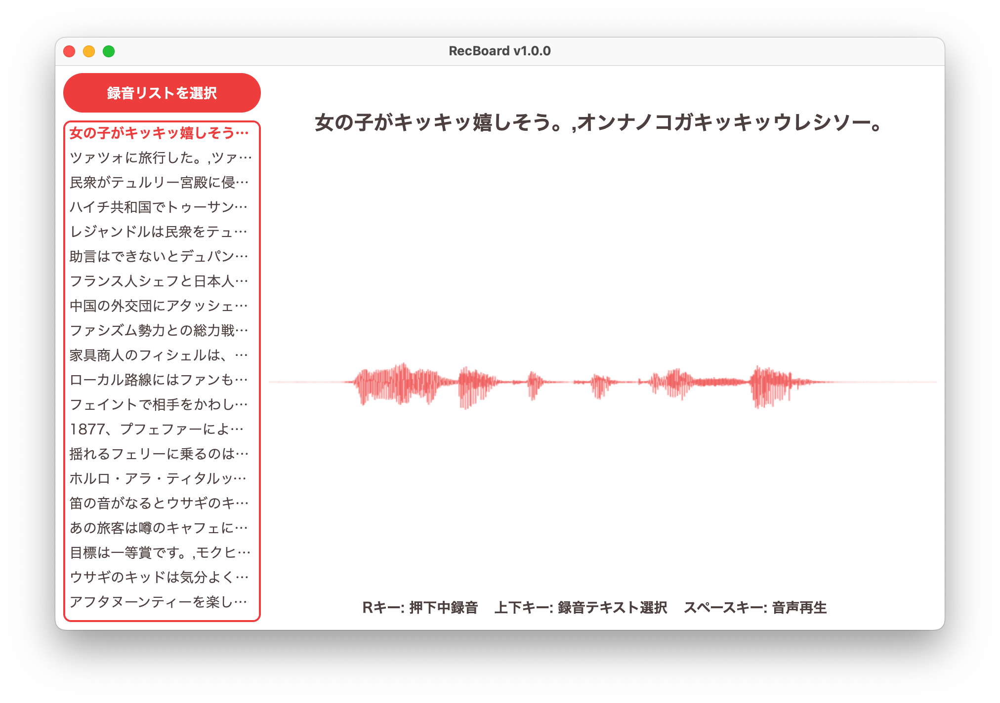

# RecBoard
シンプルなボイスレコーダー  


## 使い方

### FFmpegの導入
RecBoardはFFmpegに依存しています  
FFmpegをインストールし、PATHを通してください  

### 起動
RecBoardを起動します  
Windows版はRecBoard.exeを、macOS版はlaunch.commandをダブルクリックします  
(macOS版でRecBoard.appを直接起動するとファイルの保存に失敗します)  

### 録音リストの選択
録音リストを選択します  
録音リストはUTF-8で次の形式のテキストファイルを指定する必要があります  
```text
<保存するファイル名>:<読み上げるテキスト><改行>
<保存するファイル名>:<読み上げるテキスト><改行>
```
例:  
```text
RECITATION324_001:女の子がキッキッ嬉しそう。,オンナノコガキッキッウレシソー。
RECITATION324_002:ツァツォに旅行した。,ツァツォニリョコーシタ。
```
改行コードはCRLF, LF, CRが使用できます  
保存するファイル名は拡張子無しで指定する必要があります  

### 操作
キーボードの上下キーで録音するテキストを選択し、Rキーを押下して録音を開始します  
Rキーを離すと録音が停止し、自動で音声が保存されます  
スペースキーを押すと、録音した音声が再生されます  

## ソースからビルドする
```bash
$ git clone https://github.com/KoharuYuzuki/RecBoard.git
$ cd RecBoard
$ npm install

# windows
$ npm run build:win

# macOS
$ npm run build:mac
```

## ライセンス
Copyright (c) 2023 KoharuYuzuki  
Released under the MIT license  
https://opensource.org/license/mit/  
